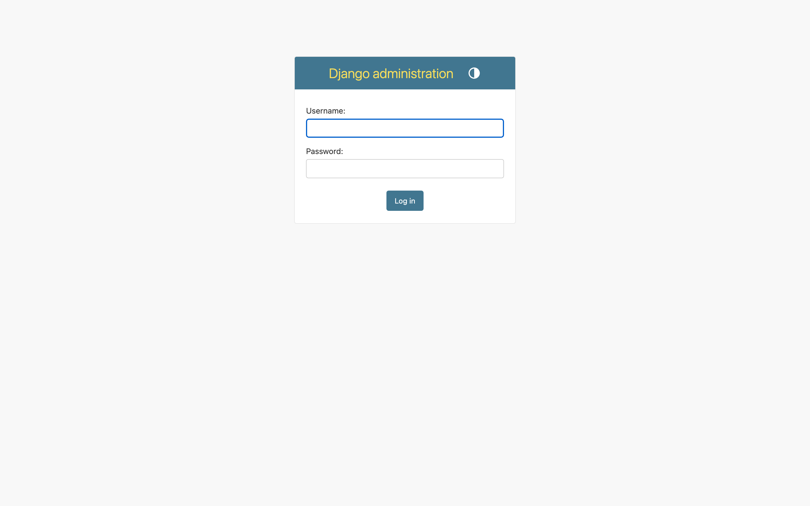
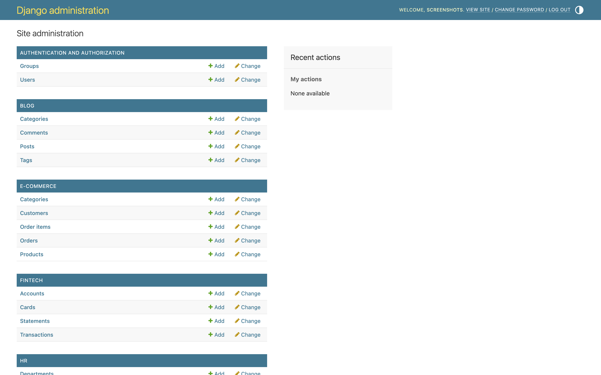
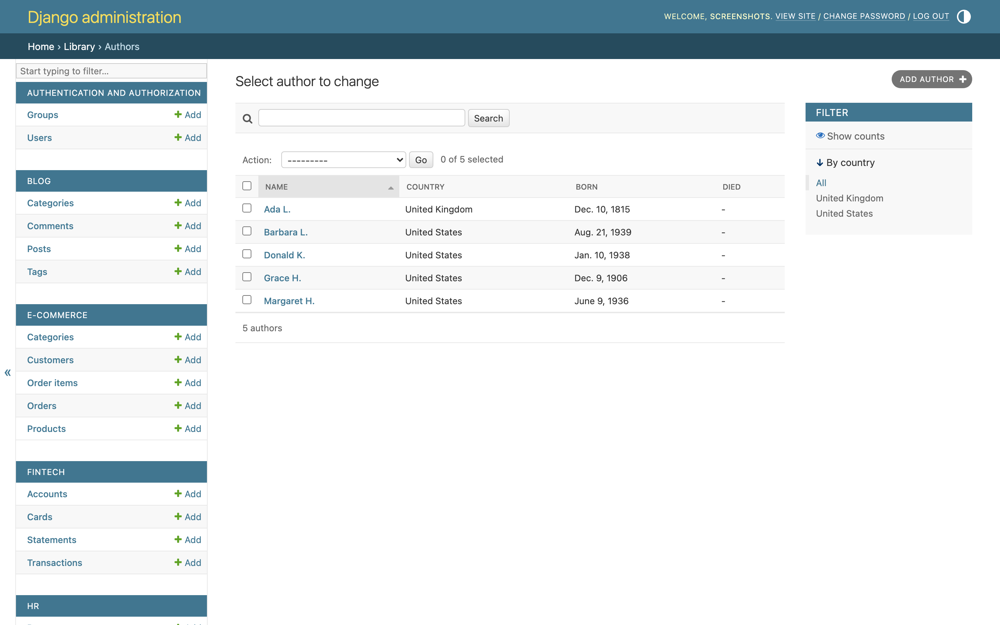
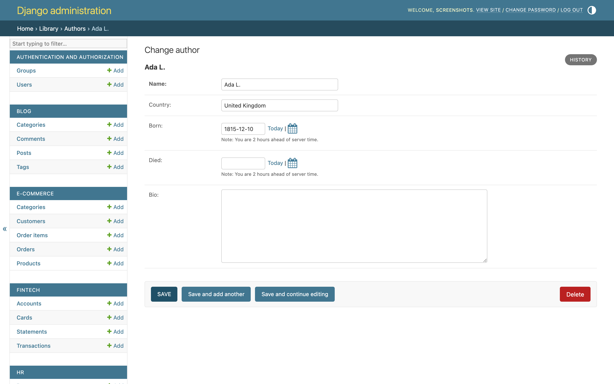
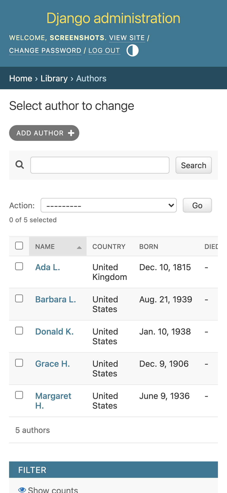
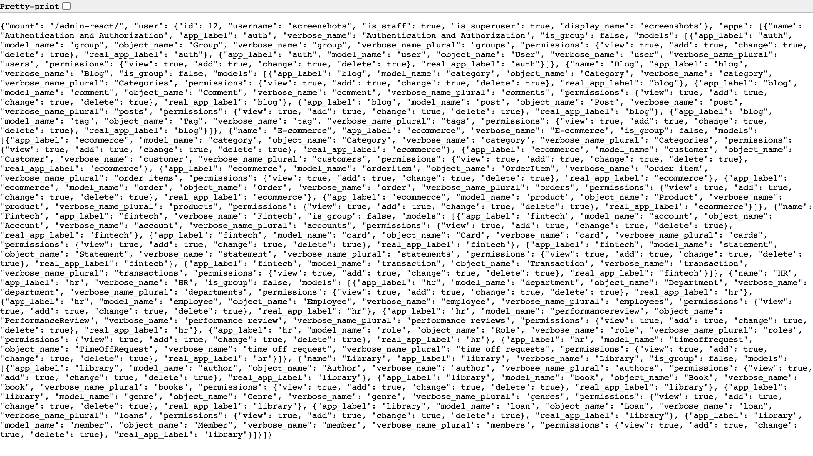

# django-admin-react

A drop-in **React single-page admin** for any Django 5+ project. Same
`pip install`, same `INSTALLED_APPS`, same `urls.py include()` — and
your `ModelAdmin` classes drive everything. No React code on your side.

> **Pre-alpha.** Available on PyPI as an alpha. Pin tightly; expect
> breaking changes between alpha releases. Track progress on the
> [Project board](https://github.com/users/MartinCastroAlvarez/projects/3)
> and the [Issues list](https://github.com/MartinCastroAlvarez/django-admin-react/issues).

---

## Install

```bash
pip install django-admin-react
```

```python
# settings.py
INSTALLED_APPS = [
    "django.contrib.admin",
    "django.contrib.auth",
    "django.contrib.contenttypes",
    "django.contrib.sessions",
    "django.contrib.messages",
    "django.contrib.staticfiles",
    "django_admin_react",   # ← add this
    # ... your own apps
]
```

```python
# urls.py
from django.urls import include, path

urlpatterns = [
    path("admin/", include("django_admin_react.urls")),
    # any prefix is fine:
    # path("admin-react/", include("django_admin_react.urls")),
    # path("staff/",       include("django_admin_react.urls")),
]
```

That is the entire integration. Log in as a staff user → modern,
Tailwind-styled SPA driven by your existing `ModelAdmin` classes.

The wheel ships the **pre-built React bundle**. You do **not** need
Node, pnpm, or any frontend toolchain to install or run.

### Optional configuration

All settings are optional. Defaults shown:

```python
DJANGO_ADMIN_REACT = {
    "ADMIN_SITE": "django.contrib.admin.site",   # dotted path to AdminSite instance
    "DEFAULT_PAGE_SIZE": 25,
    "MAX_PAGE_SIZE": 200,
    "ENABLE_PROFILING": False,
}
```

### Requirements

- **Python**: 3.10+
- **Django**: 5.0, 5.1, 5.2, 6.0 (and any later 6.x)
- **Database**: anything Django supports — the package is ORM-only, no
  direct SQL.
- **Auth**: Django's built-in session + CSRF. Works with custom
  `AUTH_USER_MODEL`, custom `AUTHENTICATION_BACKENDS`, and custom
  `AdminSite.has_permission`.

---

## Screenshots

> **Captured live** with `scripts/screenshots.sh` from
> `examples/project/` — real pixels, not mockups. The React SPA
> shell is in flight; until then, the images below show the
> **legacy HTML admin** running against the example apps — i.e.,
> the experience `django-admin-react` modernises. Once the SPA
> renders, this section regenerates from the same script.

| Login (the entry door)                            | Admin index (legacy)                                    |
| ------------------------------------------------- | ------------------------------------------------------- |
|      |      |

| Library / Authors — list view                                  | Library / Author — detail view                                  |
| -------------------------------------------------------------- | --------------------------------------------------------------- |
|      |   |

| Mobile (375 px)                                                       | API: `GET /api/v1/registry/` JSON                       |
| --------------------------------------------------------------------- | ------------------------------------------------------- |
|      |  |

> **Note for the next PyPI release:** these image refs need to be
> absolute URLs (`https://raw.githubusercontent.com/.../main/docs/screenshots/...`)
> for the PyPI page to render them. The switch happens in the
> `0.1.0a2` release PR, which also requires the repo to be public so
> `raw.githubusercontent.com` resolves without auth. Until then,
> relative paths render correctly on the GitHub README.

Every screenshot uses a deterministic synthetic seed (no real
people, accounts, or PII).

---

## Extend without writing React

Everything below is **just `ModelAdmin`**. No JavaScript. No new
classes. The UI follows whatever your admin declares.

### Pick what columns appear on the list view

```python
@admin.register(Invoice)
class InvoiceAdmin(admin.ModelAdmin):
    list_display = ("number", "customer", "status", "total", "issued_at")
```

### Make columns sortable

```python
class InvoiceAdmin(admin.ModelAdmin):
    list_display   = ("number", "customer", "status", "total", "issued_at")
    sortable_by    = ("issued_at", "total")        # everything else is fixed
```

### Add free-text search

```python
class InvoiceAdmin(admin.ModelAdmin):
    search_fields  = ("number", "customer__name", "notes__icontains")
    # The SPA wires `?q=<term>` to `ModelAdmin.get_search_results` verbatim.
```

### Default ordering

```python
class InvoiceAdmin(admin.ModelAdmin):
    ordering = ("-issued_at",)
```

### Hide a field from the form

```python
class InvoiceAdmin(admin.ModelAdmin):
    exclude         = ("internal_audit_hash",)   # never reaches the SPA
    readonly_fields = ("total",)                 # rendered as read-only
```

The SPA respects `exclude` and `readonly_fields` exactly the way the
legacy admin does. Sensitive-named fields (`password`, `secret`,
`token`, `api_key`, `hash`, `private_key`, `session`, `nonce`, `salt`)
are filtered on top of those rules as defense-in-depth.

### Group fields into sections

```python
class InvoiceAdmin(admin.ModelAdmin):
    fieldsets = (
        ("Identity",     {"fields": ("number", "customer")}),
        ("Money",        {"fields": ("subtotal", "tax", "total")}),
        ("Lifecycle",    {"fields": ("status", "issued_at", "paid_at")}),
        ("Internal",     {"fields": ("notes",), "classes": ("collapse",)}),
    )
```

### Per-row permission gating

```python
class InvoiceAdmin(admin.ModelAdmin):
    def has_add_permission(self, request):
        return request.user.has_perm("billing.create_invoice")

    def has_change_permission(self, request, obj=None):
        if obj is None:
            return request.user.has_perm("billing.change_invoice")
        return obj.owner_id == request.user.id   # row-level rule

    def has_delete_permission(self, request, obj=None):
        return False    # nobody deletes invoices

    def has_view_permission(self, request, obj=None):
        return request.user.has_perm("billing.view_invoice")
```

The SPA hides the **Add** / **Save** / **Delete** buttons automatically
based on these. UI never invents a permission; it asks `ModelAdmin`.

### Restrict the queryset

```python
class InvoiceAdmin(admin.ModelAdmin):
    def get_queryset(self, request):
        qs = super().get_queryset(request)
        if request.user.is_superuser:
            return qs
        return qs.filter(owner=request.user)
```

The list view never sees rows the queryset excludes. **No
`Model.objects.all()` in the package** — every list, search, and
detail lookup starts at `ModelAdmin.get_queryset(request)`.

### Custom save hook

```python
class InvoiceAdmin(admin.ModelAdmin):
    def save_model(self, request, obj, form, change):
        obj.last_edited_by = request.user
        super().save_model(request, obj, form, change)
```

Writes always go through `ModelAdmin.get_form()` → `form.is_valid()`
→ `save_model()`. Signals, audit logs, and post-save hooks all fire
exactly like they do in `/admin/`.

### Use a custom `AdminSite`

```python
# myproject/admin.py
from django.contrib.admin import AdminSite

class StaffAdminSite(AdminSite):
    site_header = "Operations Console"
    site_title  = "Ops"
    index_title = "Welcome"

    def has_permission(self, request):
        return request.user.is_active and request.user.is_staff and \
               request.user.groups.filter(name="ops").exists()

staff_admin = StaffAdminSite(name="staff")

# myproject/settings.py
DJANGO_ADMIN_REACT = {
    "ADMIN_SITE": "myproject.admin.staff_admin",
}
```

The SPA inherits the custom site's permission gate and the
`ModelAdmin` registrations on that site — no parallel registry.

### Pre-built form / queryset overrides still work

`get_form`, `get_fieldsets`, `get_fields`, `get_exclude`,
`get_readonly_fields`, `get_search_results`, `get_list_display`,
`get_sortable_by` — all of them are called by the SPA the same way the
HTML admin calls them. If you customised them for `/admin/`, the SPA
already honours those customisations.

---

## What's not yet supported (tracked)

The pre-alpha intentionally ships a small backend. The following
`ModelAdmin` features are on the roadmap but not in the alpha — open
issues with acceptance signals:

| Feature | Issue | Workaround for now |
|---|---|---|
| `inlines` (`TabularInline` / `StackedInline`) | [#54](https://github.com/MartinCastroAlvarez/django-admin-react/issues/54) | Edit the child model directly under its own admin URL |
| `ManyToManyField` read + write | [#55](https://github.com/MartinCastroAlvarez/django-admin-react/issues/55) | Exclude the field; manage relation through a dedicated admin |
| `list_filter` (the left sidebar) | [#56](https://github.com/MartinCastroAlvarez/django-admin-react/issues/56) | Use `search_fields` for the same intent |
| `FileField` / `ImageField` upload | [#57](https://github.com/MartinCastroAlvarez/django-admin-react/issues/57) | Use the legacy admin for these models |
| `ModelAdmin.actions` + bulk select | [#58](https://github.com/MartinCastroAlvarez/django-admin-react/issues/58) | One-off DRF endpoint or management command |
| `autocomplete_fields` / `raw_id_fields` | [#59](https://github.com/MartinCastroAlvarez/django-admin-react/issues/59) | Keep FK target tables small for now |
| `JSONField` / `ArrayField` / range types (and `register_field_type` hook) | [#60](https://github.com/MartinCastroAlvarez/django-admin-react/issues/60) | Mark as `readonly`; edit via shell |
| `list_editable` + bulk PATCH | [#61](https://github.com/MartinCastroAlvarez/django-admin-react/issues/61) | Edit row-by-row |
| `date_hierarchy` drill-down | [#62](https://github.com/MartinCastroAlvarez/django-admin-react/issues/62) | `?ordering=-date_field` and scroll |
| Session-expiry / re-login modal | [#63](https://github.com/MartinCastroAlvarez/django-admin-react/issues/63) | Browser refresh on 403 |
| OpenAPI / JSON Schema endpoint | [#64](https://github.com/MartinCastroAlvarez/django-admin-react/issues/64) | Hand-maintain types from `docs/api-contract.md` |
| Per-model React extension points | [#65](https://github.com/MartinCastroAlvarez/django-admin-react/issues/65) | Use the legacy admin for model-specific UIs |

Mount the SPA at a **second path** (`path("admin2/", include("django_admin_react.urls"))`)
alongside `/admin/` while the gaps close. Both run off the same
`ModelAdmin` registrations.

---

## What you get

- **Plug-and-play**: works with any `ModelAdmin` you already have.
- **Shared auth**: Django sessions, CSRF, staff permissions. No new
  user model, no parallel permission system.
- **Responsive, modern UI**: React + Tailwind + React Query, served
  as a single bundle from `django_admin_react/static/admin_react/`.
- **Extensible by editing `ModelAdmin`**, not React.
- **Configurable URL prefix** — `/admin/`, `/admin-react/`, anywhere.
- **Conservative & secure-by-default** — never exposes models the
  admin doesn't already expose; never writes fields the admin form
  excludes; CSRF on every unsafe method; `Cache-Control: no-store`
  on every API response; sensitive-name denylist on top of the
  admin's own `exclude` rules.
- **Boring + auditable** — no parallel permission system, no
  client-side workarounds for backend permissions, conservative
  serializer with `str()` fallback.

---

## License

MIT — see [`LICENSE`](https://github.com/MartinCastroAlvarez/django-admin-react/blob/main/LICENSE).

## Security

Please report security issues privately through GitHub's Private
Vulnerability Reporting on the repository (Security → Advisories).
See [`SECURITY.md`](https://github.com/MartinCastroAlvarez/django-admin-react/blob/main/SECURITY.md).
Do **not** open a public issue.

## Contributing

Humans and AI agents both welcome. Start with
[`CONTRIBUTING.md`](https://github.com/MartinCastroAlvarez/django-admin-react/blob/main/CONTRIBUTING.md).
